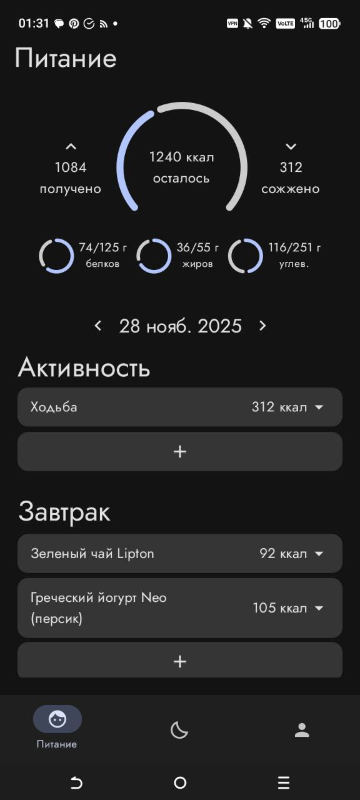

# Описание
Приложение будет включать интерактивный дневник питания с сканером штрихкодов для автоматического занесения продуктов и их КБЖУ, а также систему умных напоминаний, которые адаптируются к расписанию студента и напоминают не только о приемах пищи, но и о времени отхода ко снудля соблюдения режима. Для формирования полезных привычек будет реализована система еженедельных персонализированных чек-листов, например, "выпить 2 литра воды сегодня" или "съесть 3 порции овощей", с награждением баллами за выполнение. Кроме того, будет создан раздел с таймерами для продуктивной работы по технике Pomodoro и функцией "Вечерний ритуал", которая мягко напоминает о необходимости завершить дела и начать подготовку ко сну для полноценного отдыха.

# Скриншот

# Баннер

